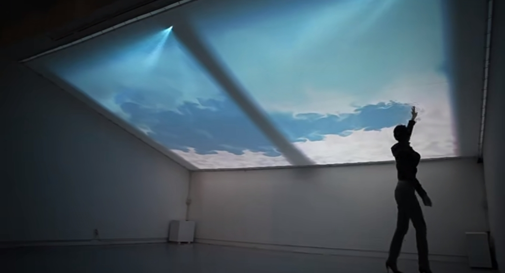

# xcao0633_TU2_Quiz_8
Quiz 8 submission

**This is my research report**

#Part 1

*Inspiration Source*

I was inspired by the design project and the film poster.I was drawn to the textured clouds in the film, the image is from Makoto Shinkai's film Weathering With You, there are many shots of the sky and clouds throughout the film that are full of beauty.

 I would like to incorporate this design from the example "Touching the Clouds" into my project. I think this is a very good interaction design, the mouse can be used as the user's "hand" to touch the screen.

#Part 2

*Coding reference*

I think that the sky and the clouds do not detract from the subject but at the same time cannot be ignored. Considering the requirements of the assignment, I think it is possible to code the clouds in conjunction with mouse and keyboard input animations. Allow the user to generate random clouds to fill the sky when clicking or pressing the keyboard.

